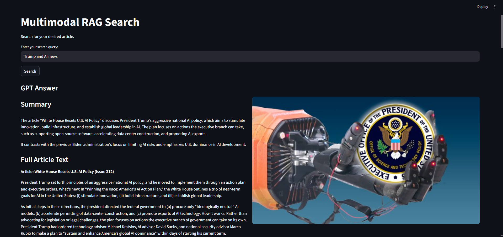

Multimodal RAG System for The Batch News

📚 How it Works

- [x] Retrieves news articles and media from The Batch using web scraping

- [x] Processes and chunks text content for efficient retrieval

- [x] Generates embeddings for both text and images using OpenAI and CLIP

- [x] Creates separate FAISS indexes for text and image data

- [x] Implements multimodal search combining text and visual relevance

- [x] Uses GPT-4o for generating contextual answers based on retrieved content

- [x] Provides Streamlit web interface for user interaction

- [x] Evaluates system performance with precision, recall, and other metrics

- [x] Supports batch processing of multiple news issues

📁 Project Structure
```text
Multimodal_RAG_project/
├── assets/                          # Demo images and video
├── config/
│   ├── config.py                    # Configuration settings
│   ├── paths.py                     # File path definitions
│   ├── rag_prompt.py                # RAG prompt templates
│   ├── system_prompt.py             # System prompt for GPT
│   └── generate_queries_prompt.py   # Query generation prompt
├── data/
│   ├── raw/                        # Raw scraped data
│   │   ├── images/                 # Original images
│   │   └── News.json               # Web scraped Data
│   ├── processed/                  # Processed data
│   │   ├── images/                 # Processed images
│   │   └── News_processed.json     # Cleaned articles
│   ├── embeddings/                 # Generated embeddings
│   │   ├── text_embeddings.json
│   │   └── image_embeddings.json
│   └── indexes/                   # FAISS indexes
│       ├── text.index
│       ├── image.index
│       └── unified_metadata.json  # data organized by article with id's
├── preprocessing/
│   ├── data_processing.py         # Article preprocessing
│   ├── image_processor.py         # Image processing
│   └── text_cleaner.py            # Text cleaning
├── tools/
│   ├── batch_scraper.py          # Web scraping from The Batch
│   ├── embeddings.py             # Embedding generation
│   └── indexes.py                # FAISS index creation
├── rag/
│   ├── rag.py                    # Main RAG logic
│   └── retriever.py              # Multimodal retrieval
├── evaluation/
│   ├── generate_queries.py       # Test query generation
│   └── system_evaluation.py      # Performance evaluation
├── vectorstore/
│   └── vectorstore.py            # Vector store interface
├── app.py                        # Streamlit web interface
├── main.py                       # CLI interface
├── requirements.txt              # Required packages
├── .env.example                  # Template for API keys
└── README.md
```

## 🚀 Getting Started
## Option A: Use the deployed application
```bash
https://multimodalragproject-knf3ubigxu7mmqpgpuzv8a.streamlit.app/
```
## Option B: Run locally
### 1. Clone the repository
```bash
git clone https://github.com/Markol06/Multimodal_RAG_project.git
cd Multimodal_RAG_project
```
### 2. Set up environment variables
Create your .env file:
```bash
cp .env.example .env
```
Then add your OpenAI API key:
```bash
OPENAI_API_KEY=
```
### 3. Install dependencies
```bash
pip install -r requirements.txt
```
### 4. Data Pipeline Setup (data is already created so you can just move to number 5 and Run the App)
Run the complete data pipeline:
```bash
# 1. Scrape data from The Batch
python tools/batch_scraper.py

# 2. Preprocess articles and images
python preprocessing/data_processing.py

# 3. Generate embeddings
python tools/embeddings.py

# 4. Create FAISS indexes
python tools/indexes.py
```
### 5. Run the app
```bash
# Web interface
streamlit run app.py

# CLI interface
python main.py
```
### 6. Make your own evaluation (already done)
```bash
# Generate test queries
python evaluation/generate_queries.py

# Run system evaluation
python evaluation/system_evaluation.py
```
## Features and Comments Documentation:
### Data ingestion:
```text
- I went through the HTML of the website and retrieved the structure and
elements that I needed to web scrap interesting part(title, images, text
including bullet fields and excluding blocks with adds.
- After web scraping I received raw data (text and images).
- Then I did some preprocessing with my texts and images to prepare it
- I received processed data with clear chunked texts and images with the 
same resolution.
```
### Multimodal processing:
```text
- I had different approaches here. I tried both different embeddings and 
indexes storages and also I tried unified storages with CLIP models.
But unified embeddings/indexes weren't working good for me.
- So I decided to make separate text(text-embedding-3-small for text-text) and 
image(openai/clip-vit-large-patch14 for text-image alignment) embeddings. 
- I worked with this openAI model for a long time so I knew it gets good
results and is cheap. As for CLIP model I just googled it because I haven't 
worked with it before.
- Then I created separate FAISS indexes from these embeddings with 
different vectors but decided to connect them via unified metadata with unique IDs
- So the idea was: if you have chosen the article correctly - unified metadata
will tell you what image to add.
```
### Search and retrieval:
```text
- For this part I am doing multimodal search through both text and image indexes.
I transform user input into embedding via OpenAI text-text text-embedding-3-small 
model. The I am looking through text FAISS indexes and retrieving top_k=5 results
with the biggest cosine similarity score.
- At this point I had 2 approaches that I tested for best evaluation results.
So I tried to pick the chunk with the highest cosine similarity score and give it
to gpt-4o model for the answer generation. And on the other hand I tried approach 
where I give to gpt-4o all top_k=5 chunks and it should decide which one is the
most relevant. Actually the first approach gave me better results so I used it.
"Top‑1 Accuracy Before": 0.875 - gave the most relevant chunk to gpt-4o
 "Top‑1 Accuracy After": 0.775 - gave top_k=5 chunks to gpt-4o
- So, when the main chunk is picked, I also give gpt-4o other chunks and images
to form the wholesome answer in the right order.
- I think it would be better to give images just right away from the metadata, 
because I have URL for images there, but I decided to search through image indexes
just to try this approach.
- Then context with all chunks, title and images is formed for gpt-4o to answer.
```
### User interface:
```text
- For user interface I used streamlit with basic UI and real time processing.
- Answer: on the left side there will be title and shor summary section with
the whole article following and on the right side you will see relevant images
from the article.
- Under the main section you will see top-5 relevant text chunks with scores
and associated images.
- UI is user-friendly and intuitive.
```
### Evaluation:
```text
- I automated my evaluation process. In generate_queries.py gpt-4o generated for me 
three ranges of queries from simple and direct to noisy for each article.
- Then in system_evaluation I evaluated these queries and got such results:
"average_metrics": {
    "mean_precision@5": 0.49666666666666665,
    "mean_recall@5": 0.8916666666666667,
    "mean_mrr": 0.8988888888888888,
    "mean_ndcg@5": 0.8782257483292177,
    "map": 0.856412037037037,
    "mean_top1_accuracy": 0.875
- MeanPrecision@5 needs further explanation because we did our calculations 
on top_k=5 so we were calculating how much relevant chunks are there in top-5 results,
but we have usually only 3 chunks in the same article at all (sometimes 2, sometimes 4)
So if we pay attention to it - our result here is actually good.
- MeanRecall@5 shows also very good results. Almost 90% of all target
chunks were chosen.
- Mean MRR also shows that in most cases relevant chunk is on 1st or 2nd position
by cosine similarity (that's why I decided just to send the most relevant chunk
 to gpt-4o.
 - Mean nDCG@5 shows us also good results. It also means that relevant results
 are usually on high positions of relevancy in search result.
 - Mean Average Precision result proves all points above.
 - At the end I decided to calculate also Mean Top-1 accuracy to see how 
 much results are predicted(and sent to gpt-4o) correctly and it also shows good
 result. But it would be great to improve it to 0.9+
```
## Configuration:
```text
Key configuration options in config/ :
- Model selection (OpenAI, CLIP)
- Chunk size and overlap settings
- Top-K retrieval parameters
- Temperature settings for GPT responses
- File path configurations
- RAG/system/queries_generation prompts
```

## Usage Example:

More demo images and video in assets/.
